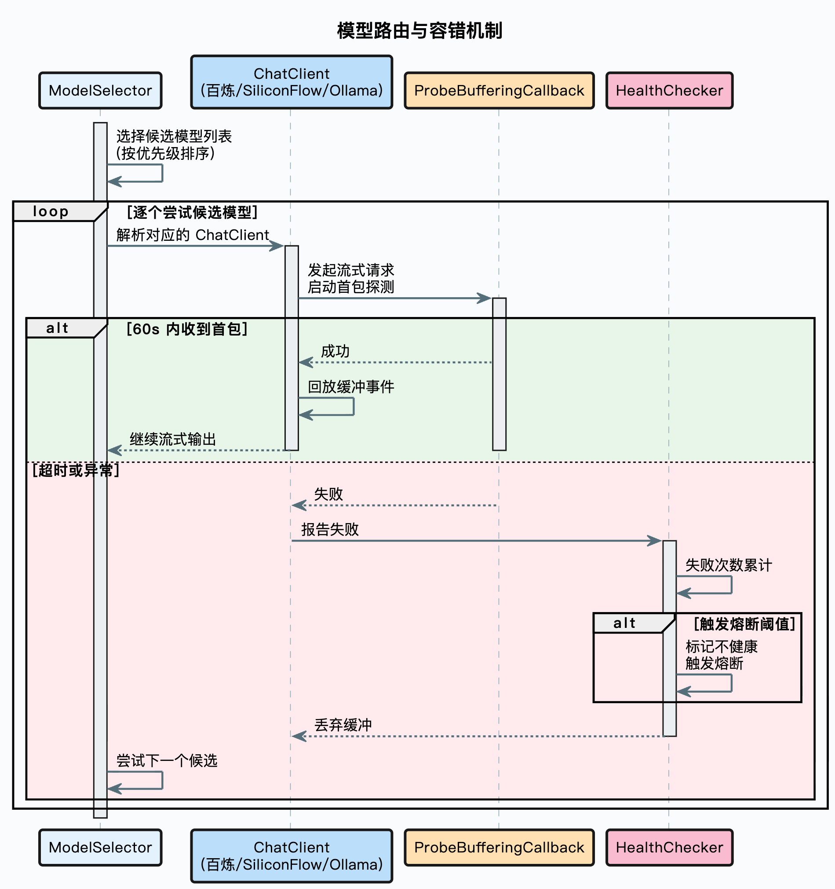

# AI-Compete 智赛通


> 面向人工智能大赛服务的企业级 RAG 智能体平台，围绕赛题技术文档解析与算法指导问答场景，提供问题重写、意图识别、多路检索、会话记忆、MCP 工具调用等核心能力。基于多模型路由、熔断降级、并发限流及全链路追踪，全面保障赛前高并发下的高可用与可观测性。

## 项目介绍


问答页面预览：


## 核心能力

- **多路检索引擎**：意图定向检索 + 全局向量检索并行执行，结果经去重、重排序后处理，兼顾精准度与召回率
- **意图识别与引导**：树形多级意图分类（领域→类目→话题），置信度不足时主动引导澄清，而非硬猜答案
- **问题重写与拆分**：多轮对话自动补全上下文，复杂问题拆为子问题分别检索，解决"说的不是想问的"
- **会话记忆管理**：保留近 N 轮对话，超限自动摘要压缩，控 Token 成本不丢上下文
- **模型路由与容错**：多模型优先级调度、首包探测、健康检查、自动降级，单模型故障不影响服务
- **MCP 工具集成**：意图非知识检索时自动提参调用业务工具，检索与工具调用无缝融合
- **竞赛专属工具**：内置全网搜索、Git 源码解析、论文查找等 MCP 工具，打破 LLM 知识边界
- **文档入库 ETL**：节点编排 Pipeline，从抓取、解析、增强、分块、向量化到写入，灵活配置可扩展
- **全链路追踪**：重写、意图、检索、生成每个环节均有 Trace 记录，排查与调优有据可依
- **管理后台**：React 管理界面，覆盖知识库管理、意图树编辑、入库监控、链路追踪、系统设置

## 目录

- [技术架构](#技术架构)
  - [技术栈](#技术栈)
  - [模块结构](#模块结构)
  - [RAG 核心流程](#rag-核心流程)
  - [多路检索架构](#多路检索架构)
  - [模型路由与容错](#模型路由与容错)
  - [文档入库流水线](#文档入库流水线)
- [项目结构](#项目结构)
- [快速开始](#快速开始)
- [配置说明](#配置说明)
- [界面展示](#界面展示)
- [设计模式](#设计模式)
- [扩展指南](#扩展指南)
- [License](#license)

## 技术架构

### 技术栈

| 层面 | 技术选型 |
|------|---------|
| 后端框架 | Java 17、Spring Boot 3.5.7、MyBatis Plus |
| 前端框架 | React 18、Vite、TypeScript、Zustand |
| 关系数据库 | PostgreSQL（20+ 业务表 + pgvector 向量扩展） |
| 向量数据库 | Milvus 2.6 / PgVector（双引擎可切换） |
| 缓存/限流 | Redis + Redisson |
| 对象存储 | S3 兼容存储（RustFS） |
| 消息队列 | RocketMQ 5.x |
| 文档解析 | Apache Tika 3.2 |
| 模型供应商 | 百炼（阿里云）、SiliconFlow、Ollama（本地） |
| 认证鉴权 | Sa-Token |
| 代码规范 | Spotless（自动格式化） |

### 模块结构

```
┌─────────────────────────────────────────────────────────────────┐
│                         父 POM (ai-compete)                      │
│              统一管理依赖版本、插件、构建配置                      │
└────────────────────────┬────────────────────────────────────────┘
                         │
        ┌────────────────┼────────────────┐
        │                │                │
        ▼                ▼                ▼
┌───────────────┐  ┌────────────┐  ┌──────────────┐
│  framework    │  │  infra-ai  │  │  mcp-server  │
│  (技术中台)    │◄─┤  (AI 中台)   │  │  (工具服务)   │
│               │  │            │  │              │
│ • Redis       │  │ • Chat     │  │ • MCP        │
│ • PostgreSQL  │  │ • Embedding│  │   Protocol   │
│ • RocketMQ    │  │ • Rerank   │  │ • JSON-RPC   │
│ • Sa-Token    │  │ • Routing  │  │ • Skills     │
│ • MyBatis Plus│  │ • Health   │  │              │
└───────┬───────┘  └─────┬──────┘  └──────────────┘
        │                │
        └────────┬───────┘
                 │
                 ▼
        ┌─────────────────┐
        │   bootstrap     │
        │   (应用层)       │
        │                 │
        │ • RAG Core      │
        │ • Ingestion     │
        │ • Knowledge     │
        │ • Competition   │
        │ • Admin         │
        └─────────────────┘
```

**依赖方向**：
- `bootstrap` 依赖 `framework` + `infra-ai`（编译期 + 运行期）
- `infra-ai` 依赖 `framework`（编译期 + 运行期）
- `mcp-server` 独立部署，通过 HTTP 与 `bootstrap` 通信（运行期）

### RAG 核心流程

一次用户提问，在系统中经过的完整链路：

```
用户问题
  │
  ▼
加载历史对话 + 追加当前问题 (ConversationMemoryService)
  │
  ▼
查询改写 + 多问句拆分 (QueryRewriteService)
  │
  ▼
意图解析 (IntentResolver → IntentClassifier)
  │
  ▼
歧义检测与引导 (IntentGuidanceService)
  │    └─ 检测到歧义 → 返回引导提示，等待用户澄清
  │
  ▼
闲聊判断 → 全部为 System 意图则直接 LLM 回答
  │
  ▼
执行检索 (RetrievalEngine)
  │    ├─ 知识库检索 (MultiChannelRetrievalEngine)
  │    │   ├─ IntentDirectedSearchChannel (意图定向检索)
  │    │   └─ VectorGlobalSearchChannel (全局向量检索)
  │    │   └─ 后处理: 去重 → 重排序
  │    └─ MCP 工具调用 (MCPToolRegistry → MCPToolExecutor)
  │
  ▼
Prompt 编排 (RAGPromptService)
  │    ├─ KB_ONLY 场景
  │    ├─ MCP_ONLY 场景
  │    └─ MIXED 场景
  │
  ▼
流式 LLM 生成回答 (LLMService → StreamCallback → SSE)
```


### 多路检索架构

检索是 RAG 系统的核心，采用多通道并行 + 后处理流水线的架构：


每个通道独立执行、互不影响，通过线程池并行调度。后处理器按顺序串联，像流水线一样逐步精炼检索结果。

### 模型路由与容错

生产环境不可能只依赖一个模型供应商，模型路由机制解决的就是这个问题：



关键设计：首包探测阶段会缓冲所有事件，确保模型切换时用户端不会收到半截的脏数据。

### 文档入库流水线

文档从上传到可检索，经过一条基于节点编排的 Pipeline：


每个节点的配置存储在数据库中，支持条件执行和输出链式传递。每个任务和节点都有独立的执行日志，出了问题能精确定位到哪一步。

## 项目结构

```
ragent-main/
├── bootstrap/                    # 核心业务启动模块
│   └── src/main/java/.../ragent/
│       ├── rag/                  # RAG 对话核心
│       │   ├── core/             # 核心领域组件
│       │   │   ├── intent/       #   意图分类与解析
│       │   │   ├── guidance/     #   歧义检测与引导
│       │   │   ├── retrieve/     #   检索引擎（多通道并行）
│       │   │   ├── mcp/          #   MCP 工具集成
│       │   │   ├── memory/       #   对话记忆管理
│       │   │   ├── prompt/       #   Prompt 编排
│       │   │   ├── rewrite/      #   查询改写
│       │   │   └── vector/       #   向量存储（Milvus/PgVector）
│       │   ├── service/          # 业务服务层
│       │   ├── controller/       # 控制器层
│       │   ├── aop/              # AOP 切面（限流、追踪）
│       │   ├── config/           # 配置类
│       │   ├── dao/              # 数据访问层
│       │   └── mq/               # 消息队列消费者
│       ├── ingestion/            # 文档摄入流水线
│       │   ├── engine/           #   流水线执行引擎
│       │   ├── node/             #   流水线节点（Fetcher/Parser/Chunker/...）
│       │   ├── domain/           #   领域模型
│       │   ├── strategy/         #   抓取策略（本地/HTTP/S3/飞书）
│       │   └── service/          #   业务服务
│       ├── knowledge/            # 知识库管理
│       │   ├── controller/       #   知识库/文档/切片/竞赛 API
│       │   ├── service/          #   业务服务
│       │   ├── dao/              #   数据实体
│       │   ├── mq/               #   文档切片消息消费
│       │   └── schedule/         #   文档定时刷新调度
│       ├── core/                 # 文档处理核心
│       │   ├── chunk/            #   分块策略（固定大小/结构感知）
│       │   └── parser/           #   文档解析（Tika/Markdown/OCR/竞赛文档）
│       ├── admin/                # 管理后台
│       └── user/                 # 用户与认证
├── framework/                    # 基础框架层
│   └── src/main/java/.../framework/
│       ├── convention/           # 统一返回结果
│       ├── trace/                # RAG 全链路追踪
│       ├── web/                  # SSE 发送、全局异常处理
│       ├── exception/            # 三级异常体系
│       ├── mq/                   # RocketMQ 生产者适配
│       ├── idempotent/           # 提交幂等 / 消费幂等
│       ├── distributedid/        # 雪花算法分布式 ID
│       ├── context/              # 用户上下文（TTL 透传）
│       └── database/             # MyBatis-Plus 自动填充
├── infra-ai/                     # AI 基础设施层
│   └── src/main/java/.../infra/
│       ├── chat/                 # LLM 调用（百炼/SiliconFlow/Ollama）
│       ├── embedding/            # 向量化服务
│       ├── rerank/               # 重排序服务
│       ├── model/                # 模型路由（优先级/熔断/降级）
│       └── token/                # Token 计数
├── mcp-server/                   # MCP 协议服务端（独立部署）
│   └── src/main/java/.../mcp/
│       ├── core/                 # 工具注册与执行
│       ├── endpoint/             # HTTP 入口、请求分发
│       ├── executor/             # 工具执行器（天气/工单/销售）
│       ├── protocol/             # JSON-RPC 协议层
│       └── skill/                # Skill 系统
├── frontend/                     # React 前端
│   └── src/
│       ├── pages/                # 页面
│       │   ├── ChatPage.tsx      #   聊天页
│       │   ├── LoginPage.tsx     #   登录页
│       │   └── admin/            #   管理后台页面
│       │       ├── dashboard/    #     仪表盘
│       │       ├── knowledge/    #     知识库管理
│       │       ├── intent-tree/  #     意图树编辑
│       │       ├── ingestion/    #     入库监控
│       │       ├── traces/       #     链路追踪
│       │       ├── users/        #     用户管理
│       │       └── settings/     #     系统设置
│       ├── components/           # 组件
│       │   ├── chat/             #   聊天组件
│       │   ├── layout/           #   布局组件
│       │   ├── session/          #   会话组件
│       │   └── admin/            #   管理后台组件
│       ├── services/             # API 服务
│       ├── stores/               # Zustand 状态管理
│       └── hooks/                # 自定义 Hooks
├── resources/
│   ├── database/                 # 数据库脚本
│   │   ├── schema_pg.sql         #   PostgreSQL 建表脚本
│   │   ├── init_data_pg.sql      #   初始化数据
│   │   └── backups/              #   备份脚本
│   ├── docker/                   # Docker Compose 配置
│   │   ├── milvus-stack-2.6.6.compose.yaml
│   │   ├── rocketmq-stack-5.2.0.compose.yaml
│   │   └── lightweight/          #   轻量级部署方案
│   ├── docs/                     # 示例知识库文档
│   └── format/                   # 代码格式化配置
├── docs/                         # 项目文档
└── skills/                       # MCP Skill 定义
```

## 快速开始

### 环境要求

- JDK 17+
- Node.js 18+
- PostgreSQL 14+（使用 PgVector 时需安装 pgvector 扩展）
- Redis 7+
- RocketMQ 5.x（或使用 Docker Compose 启动）
- Milvus 2.6+（默认向量数据库，或使用 PgVector 替代）

### 1. 启动基础设施

```bash
# 启动 RocketMQ
docker compose -f resources/docker/rocketmq-stack-5.2.0.compose.yaml up -d

# 启动 Milvus（默认向量数据库）
docker compose -f resources/docker/milvus-stack-2.6.6.compose.yaml up -d

# 低配机器使用轻量级方案
docker compose -f resources/docker/lightweight/milvus-stack-2.6.6.compose.yaml up -d
```

### 2. 初始化数据库

```bash
# 创建数据库
createdb -U postgres ragent

# 使用 PgVector 时需安装扩展（Milvus 模式下可跳过）
# psql -U postgres -d ragent -c "CREATE EXTENSION IF NOT EXISTS vector;"

# 执行建表脚本
psql -U postgres -d ragent -f resources/database/schema_pg.sql

# 导入初始数据
psql -U postgres -d ragent -f resources/database/init_data_pg.sql
```

### 3. 配置应用

编辑 `bootstrap/src/main/resources/application.yaml`，按需修改以下配置：

```yaml
spring:
  datasource:
    url: jdbc:postgresql://127.0.0.1:5432/ragent
    username: postgres
    password: postgres
  data:
    redis:
      host: 127.0.0.1
      port: 6379
      password: 123456

ai:
  providers:
    bailian:
      api-key: ${BAILIAN_API_KEY:}      # 阿里云百炼 API Key
    siliconflow:
      api-key: ${SILICONFLOW_API_KEY:}  # SiliconFlow API Key
```

### 4. 启动后端

```bash
./mvnw spring-boot:run -pl bootstrap
```

后端启动在 `http://localhost:9090`，API 前缀为 `/api/ragent`。

### 5. 启动前端

```bash
cd frontend
npm install
npm run dev
```

前端启动在 `http://localhost:5173`。

### 6. 启动 MCP Server（可选）

MCP Server 是独立的 Spring Boot 应用，提供工具调用能力：

```bash
./mvnw spring-boot:run -pl mcp-server
```

MCP Server 启动在 `http://localhost:9099`。

## 配置说明

### 向量存储引擎切换

系统默认使用 Milvus 作为向量数据库，也可切换为 PgVector：

```yaml
rag:
  vector:
    type: milvus    # 默认 milvus，可选 pg
```

### 混合检索配置

```yaml
rag:
  hybrid-search:
    enabled: false           # 是否启用混合检索
    ranker: RRF              # 排序器：RRF 或 WEIGHTED
    rrf-k: 60                # RRF 平滑参数
    vector-weight: 0.6       # 向量检索权重（WEIGHTED 模式）
    bm25-weight: 0.4         # BM25 检索权重（WEIGHTED 模式）
```

### 模型候选列表配置

```yaml
ai:
  chat:
    default-model: qwen3-max
    candidates:
      - id: qwen-plus
        provider: bailian
        model: qwen-plus-latest
        priority: 1
      - id: qwen3-max
        provider: bailian
        model: qwen3-max
        supports-thinking: true
        priority: 3
      - id: qwen3-local
        provider: ollama
        model: qwen3:8b-fp16
        priority: 2
```

### MCP 内置工具配置

```yaml
rag:
  mcp:
    builtin-tools:
      web-search:
        enabled: true
        api-key: ${SEARCH_API_KEY:}
        provider: google              # 可选: google / bing / duckduckgo
      git-source-parse:
        enabled: true
        github-token: ${GITHUB_TOKEN:}
      paper-search:
        enabled: true
        preferred-source: semantic-scholar  # 可选: semantic-scholar / arxiv / crossref
```

### 会话记忆配置

```yaml
rag:
  memory:
    history-keep-turns: 4         # 保留近 N 轮对话
    summary-start-turns: 5        # 超过 N 轮开始摘要压缩
    summary-enabled: true         # 是否启用摘要
    ttl-minutes: 60               # 会话过期时间
```

### 限流配置

```yaml
rag:
  rate-limit:
    global:
      enabled: true
      max-concurrent: 1           # 最大并发数
      max-wait-seconds: 3         # 最大等待时间
      lease-seconds: 30           # 许可证持有时间
```


## 设计模式

| 设计模式 | 应用场景 | 解决的问题 |
|---------|---------|-----------|
| 策略模式 | SearchChannel、PostProcessor、MCPToolExecutor | 检索通道、后处理器、MCP 工具可插拔替换 |
| 工厂模式 | IntentTreeFactory、StreamCallbackFactory、ChunkingStrategyFactory | 复杂对象的创建逻辑集中管理 |
| 注册表模式 | MCPToolRegistry、IntentNodeRegistry | 组件自动发现与注册，新增工具零配置 |
| 模板方法 | IngestionNode 基类 | 入库节点统一执行流程，子类只关注核心逻辑 |
| 装饰器模式 | ProbeBufferingCallback | 在不修改原有回调的前提下增加首包探测能力 |
| 责任链模式 | 后处理器链、模型降级链 | 多个处理步骤按顺序串联，灵活组合 |
| 观察者模式 | StreamCallback | 流式事件的异步通知 |
| AOP | @RagTraceNode、@ChatRateLimit | 链路追踪和限流逻辑与业务代码解耦 |

## 扩展指南

### 新增检索通道

实现 `SearchChannel` 接口，注册为 Spring Bean，自动生效：

```java
@Component
public class KeywordESSearchChannel implements SearchChannel {
    @Override
    public String getName() { return "KeywordESSearch"; }
    @Override
    public SearchChannelResult search(SearchContext context) { /* ... */ }
}
```

### 新增后处理器

实现 `SearchResultPostProcessor` 接口，自动加入处理链：

```java
@Component
public class VersionFilterPostProcessor implements SearchResultPostProcessor {
    @Override
    public String getName() { return "VersionFilter"; }
    @Override
    public List<RetrievedChunk> process(List<RetrievedChunk> chunks, ...) { /* ... */ }
}
```

### 新增 MCP 工具

实现 `MCPToolExecutor` 接口，自动被 `DefaultMCPToolRegistry` 发现：

```java
@Component
public class CustomTool implements MCPToolExecutor {
    @Override
    public String getToolName() { return "custom_tool"; }
    @Override
    public String execute(Map<String, Object> params) { /* ... */ }
}
```

### 新增入库节点

实现 `IngestionNode` 接口，可插入 Pipeline 任意位置。

### 新增模型供应商

在 `infra-ai` 层实现 `ChatClient` 接口，配置候选列表即可参与路由。

## License

[Apache License 2.0](LICENSE)
